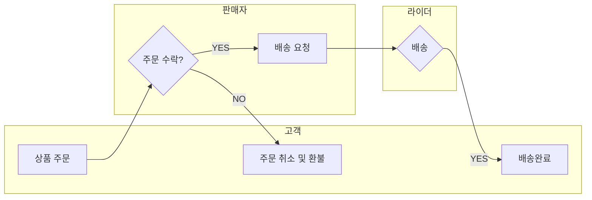

## 프로젝트 개요

**개발 기간:** 2025.07 ~ 2025.09 (8주)

**참여 인원:**  5명 (팀 프로젝트)

**역할:** 백엔드 & 프론트엔드 풀스택 개발 (팀장)

**담당 서비스:** 메인 구성 / 상품 / 장바구니 / 구매 / 에러 페이지 처리

> 프로젝트 소개
> 
> 
> “오늘의빵”은 소비자·매장·라이더 간 실시간 주문 및 배달 매칭 플랫폼입니다.
> 
> **소비자가 주문을 생성**하면 **매장이 배송을 요청**하고 인근 **라이더가 이를 수락**합니다.
> 
> WebSocket 기반의 실시간 위치 추적 및 상태 갱신을 통해 주문 진행 상황을 시각화합니다.
> 

## ⚙️ 개발 환경 및 기술 스택

| 구분 | 기술 |
| --- | --- |
| 프론트엔드 | HTML, CSS, JavaScript, jQuery, AJAX, SweetAlert2, Thymeleaf |
| 백엔드 | Java, Spring Boot, Spring Security, JPA, MyBatis, WebSocket |
| 데이터베이스 | Oracle 19c |
| **API** | Kakao Map API, TMap API, PortOneAPI |
| 협업도구 | GitHubDeskTop, GoogleSheets, Notion, ERD Cloud |

---

## 프로젝트 목표

- 배달 서비스 플랫폼의 구조를 이해하고, 구현하기
- 기존 배달 서비스에 정기구독 서비스를 더해 기획적으로 차별화
- 동네 빵집의 판매 시장 확대, 구매자의 접근성 높이기

## ▶️ 서비스 흐름도



## 사용자별 기능

| 역할 | 기능 |
| --- | --- |
| 구매자 | • 구매자의 위치를 기준으로, 주문이 가능한 상품 확인 가능
• 정기 구매 상품의 배송주기는 주1회, 2주1회, 한달 1회 중 구매자가 선택 가능, 결제는 월 1회 자동 결제됨 |
| 판매자 | • 입점을 원하는 판매자는 회원가입 후 입점신청을 통해 자신의 상점 개설 가능
• ‘내 상점’ 페이지에서 상품 등록/상태 관리, 주문 확인이 가능하고 주문을 수락하면 라이더에게 배송 요청 |
| 라이더 | • 라이더 페이지에서 회원가입하면 자동으로 라이더 계정 생성
• 배송 리스트에서 배송할 주문을 선택 후 배송단계별로 버튼을 눌러 배송 상태를 바꿀 수 있음 |
| 관리자 | 서비스 이용 통계를 확인하고, 이용자 및 상점을 제재할 수 있음 |

## ERD 구조 (요약)

> ERD Cloud [상세 이미지보기](https://drive.google.com/file/d/1LMHrYA_yuzIddy6iYnfrjK1DkgP6L0N-/view?usp=drive_link)
> 


---

## 📝담당 서비스 상세

> 메인 구성 / 상품 / 장바구니 / 구매 / 에러 페이지 처리
> 
- 사용자 위치 정보 저장하기
    
    
    
    geolocation으로 사용자의 위치 좌표 획득 → 카카오 맵 API로 주소로 변환
    
    → 시 / 군구 와 일치하는 select를 찾아 적용, 저장된 위치 정보를 상품 검색에 사용
    
- 정기결제 로직
    
    
    
    정기상품의 배송주기 선택 필수 → 첫결제에서 수기로 결제 정보 입력 (결제API활용) 
    
    → 결제정보를 가진 key값과 다음 결제&배송일을 주문정보와 함께 저장 
    
    → 스케줄러로 매일 결제일/배송일 체크 → 해당하는 일자에 결제정보를 가진 key로 자동 결제 
    
    → 새로운 주문 insert 되어 배송 진행됨
    

---

## ⛑️문제 상황과 해결

> 작업 마감까지 약 1주가 남은 시점, 사이트 통합 점검을 해보니 기능에 필요한 파라미터가 정상적으로 전달되지 않아 주문 하나도 온전히 완료할 수 없었다.
> 

⇒ **원인**

처음부터 각자의 기능 구현에만 몰두하여, 외부로부터 파라미터를 전달받거나 다른 작업자가 로직에 영향을 주는 기능에 대해 함께 논의하는 시간이 부족했고, 전체 작업 진도를 확인하는 시간도 없었다. 오류가 발생하는 부분의 작업자가 코드에 대한 이해가 부족해 온전한 기능 구현이 되고있지 않았다.

⇒ **해결**

작업 마감 기한을 2~3일 늘려 시간을 확보하고, ‘주문’ 정상 구현을 작업 우선순위로 두고 관련 작업자들이 교류하며 문제를 찾았다.

입력받은 form데이터를 AJAX로 서버에 전달할 때, JSON형식으로 값을 주고받았는데, 이 때 지정되지 않은 값도 JSON으로 클라이언트에 전달되어, 값을 제대로 사용할 수 없었다. 해당 오류가 나는 부분의 작업자 본인이 어디서 그 값을 보내고 있는지 몰랐기 때문에 직접 브라우저에서 오류가 나는 요소의 Response Header의 Content-Type 값을 확인해가며 파라미터의 타입을 맞춰나갔다.

> 상품 등록 페이지의 form에 enctype=”multipart/form-data” 추가한 뒤로, 사진을 첨부하던 안하던 form 값들이 제출되지 않고 500오류만 반복됐다.
> 

⇒ **원인**

form 내의 모든 input이 multipart타입으로 서버에 전송되어, 한 번에 10개 이상의 multipart 값이 제출되는 게 되어 **서버가 허용하는 파일 개수를 초과**했기 때문에 제출이 되고 있지 않았다.

tomcat9가 새로 업데이트 되면서 업로드 가능한 multipart 파일의 개수를 기본 10개로 제한 해서 최근 생긴 오류라고 한다. (작업 당시 2025년 9월이었음)

⇒ **해결**

properties파일에서 업로드 가능한 part 수를 직접 설정해주었다.

```java
#application.properties

server.tomcat.max-part-count=100
```

## 개선점

- 결제 트랜잭션이 처리되는 과정에서, 유효성 검사와 보안성을 더 철저하게 하고싶다.
- 위치를 설정한 뒤, 상품 목록을 새로 불러올 때 생기는 몇 초간의 딜레이를 없애고 싶다.
- 장바구니 테이블을 사용하지 않고, 세션에 상품 정보를 저장하여 수정/삭제가 잦은 데이터를 편리하게 관리하고 싶다.

---

## 프로젝트 회고

> 코드리뷰를 자주 해야 하는 이유를 실감했습니다. 다른 작업자의 코드를 보면서, 나와 다른 방법으로 기능을 구현하는 방법을 알아가는 것이 필요한 것 같습니다. 처음 써보는 API의 적용에 어려움이 있더라도 앞서 도전했던 사람들이 기록한 정보를 보고 연구와 실습을 통해 내 것으로 만드는 훈련이 필요합니다.
> 
> 
> 또, 오류의 원인을 직접 찾는 것에 익숙해지는 것이 중요한 것 같습니다. 챗GPT등의 도움을 받더라도, 자신이 직접 구조를 알고 모르는 부분을 물어보고 배우는 것이 중요하기 때문입니다.
>


# 🍞 오늘의 빵

> “오늘의 빵”은 사용자들이 근처 제과점의 당일 생산 빵을 예약 · 구매할 수 있는 웹 서비스입니다.  
> 실시간 재고 확인, 결제, 리뷰 작성이 가능하며, 제과점 사장님은 관리자 페이지를 통해 상품 관리가 가능합니다.  

---

## 👨‍👩‍👧‍👦 팀 구성 및 역할
- **윤예솔**: 팀장, 전체 아키텍처 설계, 배포 (AWS EC2, RDS)
- **안병주**: 회원가입/로그인, JWT 인증/인가
- **안성진**: 상품 등록/관리, 파일 업로드
- **이우현**: 주문/결제, 카트 기능
- **맹재희**: ERD 설계, DB 성능 최적화

> 👉 본인은 **상품 등록 및 파일 업로드, 썸머노트 적용, AWS S3 연동** 부분을 담당했습니다.

---

## ⚙️ 개발 환경 & 기술 스택
| **언어** | Java19 |
|-------------|-----------|
| **언어** | Java19 |
|-------------|-----------|
| **언어** | Java19 |
|-------------|-----------|
| **언어** | Java19 |
|-------------|-----------|
| **언어** | Java19 |

|-------------|-----------|
- **Language**: Java 17  
- **Framework**: Spring Boot 3.x, Spring Security, Spring Data JPA  
- **Database**: MySQL 8.0  
- **Frontend**: Thymeleaf, Bootstrap 5, JavaScript (AJAX)  
- **Tools & Infra**: GitHub, AWS EC2, AWS S3, Docker, IntelliJ IDEA  
- **협업 툴**: Notion, Figma, Slack  

---

## 🚀 주요 기능
### 사용자
- 회원가입 / 로그인 (JWT, Spring Security)
- 상품 목록 조회 및 상세 보기
- 장바구니 담기 및 결제 (포트원 API 연동)
- 리뷰 작성

### 관리자 (사장님)
- 상품 등록 / 수정 / 삭제
- 매출 현황 조회
- 이미지 업로드 (AWS S3 연동)

---

## 🗂️ DB 설계 (ERD)


---

## 🏗️ 시스템 아키텍처


---

## 🖼️ 화면 예시
| 메인 페이지 | 상품 상세 | 관리자 상품 등록 |
|-------------|-----------|-----------------|
|  |  |  |

---

## 📦 실행 방법
```bash
# 1. 프로젝트 클론
git clone https://github.com/username/today-sBread.git
cd today-sBread

# 2. 환경 변수 설정 (application.properties)
spring.datasource.url=jdbc:mysql://localhost:3306/bread_db
spring.datasource.username=root
spring.datasource.password=1234
