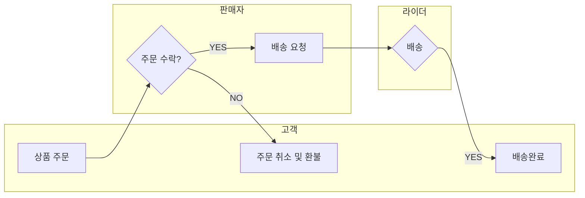

## 프로젝트 개요

**개발 기간:** 2025.07 ~ 2025.09 (8주)

**참여 인원:**  5명 (팀 프로젝트)

**역할:** 백엔드 & 프론트엔드 풀스택 개발 (팀장)

**담당 서비스:** 메인 구성 / 상품 / 장바구니 / 구매 / 에러 페이지 처리

> 프로젝트 소개
> 
> 
> “오늘의빵”은 소비자·매장·라이더 간 실시간 주문 및 배달 매칭 플랫폼입니다.
> 
> **소비자가 주문을 생성**하면 **매장이 배송을 요청**하고 인근 **라이더가 이를 수락**합니다.
> 
> WebSocket 기반의 실시간 위치 추적 및 상태 갱신을 통해 주문 진행 상황을 시각화합니다.
> 

## ⚙️ 개발 환경 및 기술 스택

| 구분 | 기술 |
| --- | --- |
| 프론트엔드 | HTML, CSS, JavaScript, jQuery, AJAX, SweetAlert2, Thymeleaf |
| 백엔드 | Java, Spring Boot, Spring Security, JPA, MyBatis, WebSocket |
| 데이터베이스 | Oracle 19c |
| **API** | Kakao Map API, TMap API, PortOneAPI |
| 협업도구 | GitHubDeskTop, GoogleSheets, Notion, ERD Cloud |

---

## 프로젝트 목표

- 배달 서비스 플랫폼의 구조를 이해하고, 구현하기
- 기존 배달 서비스에 정기구독 서비스를 더해 기획적으로 차별화
- 동네 빵집의 판매 시장 확대, 구매자의 접근성 높이기

## ▶️ 서비스 흐름도



## 사용자별 기능

| 역할 | 기능 |
| --- | --- |
| 구매자 | • 구매자의 위치를 기준으로, 주문이 가능한 상품 확인 가능
• 정기 구매 상품의 배송주기는 주1회, 2주1회, 한달 1회 중 구매자가 선택 가능, 결제는 월 1회 자동 결제됨 |
| 판매자 | • 입점을 원하는 판매자는 회원가입 후 입점신청을 통해 자신의 상점 개설 가능
• ‘내 상점’ 페이지에서 상품 등록/상태 관리, 주문 확인이 가능하고 주문을 수락하면 라이더에게 배송 요청 |
| 라이더 | • 라이더 페이지에서 회원가입하면 자동으로 라이더 계정 생성
• 배송 리스트에서 배송할 주문을 선택 후 배송단계별로 버튼을 눌러 배송 상태를 바꿀 수 있음 |
| 관리자 | 서비스 이용 통계를 확인하고, 이용자 및 상점을 제재할 수 있음 |

## ERD 구조 (요약)

> ERD Cloud [상세 이미지보기](https://drive.google.com/file/d/1LMHrYA_yuzIddy6iYnfrjK1DkgP6L0N-/view?usp=drive_link)
> 


---

## 개선점

- 결제 트랜잭션이 처리되는 과정에서, 유효성 검사와 보안성을 더 철저하게 하고싶다.
- 위치를 설정한 뒤, 상품 목록을 새로 불러올 때 생기는 몇 초간의 딜레이를 없애고 싶다.
- 장바구니 테이블을 사용하지 않고, 세션에 상품 정보를 저장하여 수정/삭제가 잦은 데이터를 편리하게 관리하고 싶다.

---

## 📦 실행 방법
```bash
# 1. 프로젝트 클론
git clone https://github.com/username/today-sBread.git
cd today-sBread

# 2. 환경 변수 설정 (application.properties)
spring.datasource.url=jdbc:mysql://localhost:3306/bread_db
spring.datasource.username=root
spring.datasource.password=1234
